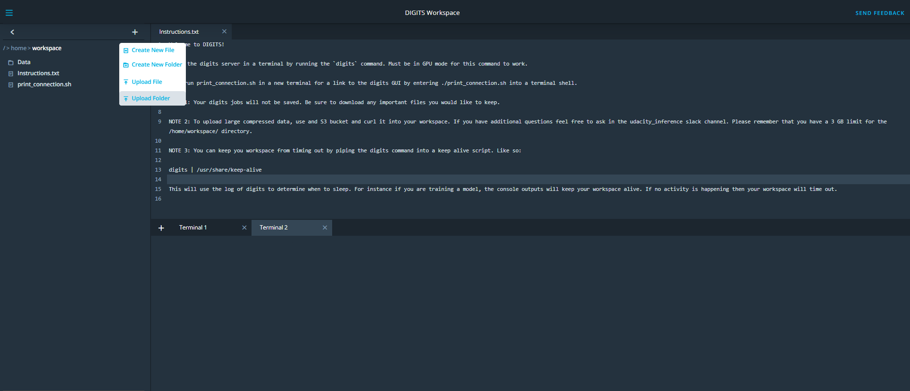

## Robotics Inference Project

Steps:

1. Collect Data
2. Upload Data
3. Open Digits
4. Create dataset
5. Select Model
6. Train Model
7. Test Model Performance
8. Evaluate
9. Deployment(Optional)

---

### 1. Collect Data

- Once the idea for the project is finalized, you can collect the data using following codes

- Collect the data in following format

  ```
  P1_data/
  ├── Bottle/
  │   ├── Bottle_1.png
  │   └── Bottle_2.png
  ├── Candy_box/
  │   ├── Candy_box_1.png
  │   └── Candy_box_2.png
  └── Nothing/
      ├── Nothing_1.png
      └── Nothing_2.png
  ```

  

- Python code:

  ```python
  import cv2
  
  # Run this script from the same directory as your Data folder
  
  # Grab your webcam on local machine
  cap = cv2.VideoCapture(0)
  
  # Give image a name type
  name_type = 'Small_cat'
  
  # Initialize photo count
  number = 0
  
  # Specify the name of the directory that has been premade and be sure that it's the name of your class
  # Remember this directory name serves as your datas label for that particular class
  set_dir = 'Cat'
  
  print ("Photo capture enabled! Press esc to take photos!")
  
  while True:
      # Read in single frame from webcam
      ret, frame = cap.read()
  
      # Use this line locally to display the current frame
      cv2.imshow('Color Picture', frame)
  
      # Use esc to take photos when you're ready
      if cv2.waitKey(1) & 0xFF == 27:
  
          # If you want them gray
          #gray = cv2.cvtColor(frame,cv2.COLOR_BGR2GRAY)
  
          # If you want to resize the image
          # gray_resize = cv2.resize(gray,(360,360), interpolation = cv2.INTER_NEAREST)
  
          # Save the image
          cv2.imwrite('Data/' + set_dir + '/' + name_type + "_" + str(number) + ".png", frame)
  
          print ("Saving image number: " + str(number))
  
          number+=1
  
      # Press q to quit the program
      if cv2.waitKey(1) & 0xFF == ord('q'):
          break
  
  cap.release()
  cv2.destroyAllWindows()
  ```

- C++ code to collect data on Jetson

  ```c++
  /*
  Compile with:
  
  gcc -std=c++11 Camera_Grab.cpp -o picture_grabber -L/usr/lib -lstdc++ -lopencv_core -lopencv_highgui -lopencv_videoio -lopencv_imgproc -lopencv_imgcodecs
  
  Requires recompiling OpenCV with gstreamer plug in on. See: https://github.com/jetsonhacks/buildOpenCVTX2
  
  Credit to Peter Moran for base code.
  http://petermoran.org/csi-cameras-on-tx2/
  */
  
  
  #include <opencv2/opencv.hpp>
  #include <string>
  
  using namespace cv;
  using namespace std;
  
  std::string get_tegra_pipeline(int width, int height, int fps) {
      return "nvcamerasrc ! video/x-raw(memory:NVMM), width=(int)" + std::to_string(width) + ", height=(int)" +
             std::to_string(height) + ", format=(string)I420, framerate=(fraction)" + std::to_string(fps) +
             "/1 ! nvvidconv flip-method=0 ! video/x-raw, format=(string)BGRx ! videoconvert ! video/x-raw, format=(string)BGR ! appsink";
  }
  
  int main() {
      // Options
      int WIDTH = 500;
      int HEIGHT = 500;
      int FPS = 30;
  
      // Directory name
      string set_dir = "Test";
      // Image base name
      string name_type = "test";
  
      int count = 0;
  
      // Define the gstream pipeline
      std::string pipeline = get_tegra_pipeline(WIDTH, HEIGHT, FPS);
      std::cout << "Using pipeline: \n\t" << pipeline << "\n";
  
      // Create OpenCV capture object, ensure it works.
      cv::VideoCapture cap(pipeline, cv::CAP_GSTREAMER);
      if (!cap.isOpened()) {
          std::cout << "Connection failed";
          return -1;
      }
  
      // View video
      cv::Mat frame;
      while (1) {
          cap >> frame;  // Get a new frame from camera
  
          // Display frame
          imshow("Display window", frame);
  
          // Press the esc to take picture or hold it down to really take a lot!
          if (cv::waitKey(1) % 256 == 27){
  
              string string_num = to_string(count);
  
              cout << "Now saving: " << string_num << endl;
  
              string save_location = "./" + set_dir + "/" + name_type + "_" + string_num + ".png";
  
              cout << "Save location: " << save_location << endl;
  
              imwrite(save_location, frame );
  
              count+=1;
  
          }
  
          cv::waitKey(1);
      }
  }
  ```


### 2. Upload Data to Workspace

- From Udacity workspace, upload the collected data 

  


### 3. Open Nvidia Digits

- In terminal 1, run following command

  ```bash
  digits
  ```

- In terminal 2, run following command

  ```bash
  ./print_connection.sh
  ```

- Click on the link the terminal and digitals will open in new tab


### 4. Prepare Dataset


- Select proper parameters and given name to the dataset

- Dataset Preview

  

  

  

  


### 5. Select Model and Training Parameters


### 6. Train the Model


### 7. Test Model Performance

- On the model training page, you can select image path and check model predictions

  


### 8. Evaluate

- To evaluate the model performance, type following command in new terminal

  ```bash
  evaluate
  ```

- The enter the job ID mentioned on the model training page


### 9. Deployment on Jetson

- Download the trained model

- Extract the model in a folder using following command

  ```bash
  tar -xzvf
  ```

- Then, create an environment variable called NET to the location of the model path. Do this by entering something like `export NET=/home/user/Desktop/my_model` into the terminal. The exact command will depend on the shell you are using.

- Navigate to the Jetson inference folder then into the executable binaries and launch imagenet or detect net like so:

  ```
  ./imagenet-camera --prototxt=$NET/deploy.prototxt --model=$NET/your_model_name.caffemodel --labels=$NET/labels.txt --input_blob=data --output_blob=softmax
  ```

  You will then observe real time results from your Jetson camera!

  If you desire to actuate based on the information the classifier is providing, you can edit either the [imagenet](https://github.com/dusty-nv/jetson-inference/blob/master/imagenet-camera/imagenet-camera.cpp) or [detectnet](https://github.com/dusty-nv/jetson-inference/blob/master/detectnet-camera/detectnet-camera.cpp) c++ file accordingly!

- Here is an example of calling a servo action based on a classification result. It can be inserted into the code [here](https://github.com/dusty-nv/jetson-inference/blob/master/imagenet-camera/imagenet-camera.cpp#L168) at line 168:

  ```c++
  std::string class_str(net->GetClassDesc(img_class));
  
  if("Bottle" == class_str){
            cout << "Bottle" << endl;
            // Invoke servo action
  }
  
  else if("Candy_Box" == class_str){
           cout << "Candy_Box" << endl;
           // Do not invoke servo action
  }
  
  else {
           // Catch anything else here
  }
  ```

  